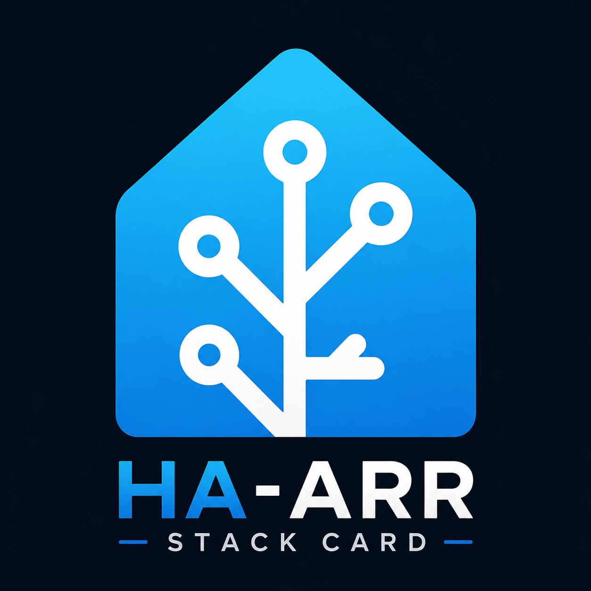

# Arr Stack Card

A Home Assistant Lovelace card that aggregates **Radarr, Sonarr, qBittorrent, SABnzbd, Overseerr/Jellyseerr and Bazarr** into a single dashboard panel.



---

## Features

- **Downloads panel** — live qBittorrent torrents and SABnzbd queue with pause/resume/delete
- **Media library** — recent Radarr movies and Sonarr shows with quality badges, subtitle status (Bazarr)
- **Discover** — Upcoming, New Shows, Trending, Popular from Overseerr with one-click requests
- **Interactive Search** — Radarr/Sonarr release grabber inside a popup
- **Section overlay** — full-screen browsing grid for any section via "See More" card
- **Popup detail** — poster, overview, cast, ratings, request/remove actions
- **Day/night theming** via `sun.sun` entity
- **Mobile-first** responsive layout with swipe gestures

---

## Installation

### HACS (recommended)

1. Add this repository to HACS as a custom repository (type: Lovelace)
2. Install **Arr Stack Card**
3. Add the resource and configure (see below)

### Manual

1. Copy `output/arr-stack-card.js` to `/config/www/arr-stack-card.js`
2. Copy `output/custom_components/arr_stack/` to `/config/custom_components/arr_stack/`
3. Add the resource in **Settings → Dashboards → Resources**:
   ```
   /local/arr-stack-card.js
   ```
4. Restart Home Assistant
5. Configure the integration: **Settings → Devices & Services → Add Integration → Arr Stack**

---

## Configuration

### Minimal example

```yaml
type: custom:arr-stack-card
```

### Complete example

```yaml
type: custom:arr-stack-card
localisation: en             # cs | en  (default: cs)
layout: both                 # both | left | right  (default: both)
sticky_nav_offset: 100       # px — when sticky nav bar appears on mobile  (default: 100)

downloads:
  torrentItems: 3            # qBittorrent items per page  (default: 3)
  usenetItems: 3             # SABnzbd items per page  (default: 3)

discover:
  categoriesCount: 3         # media categories shown per right-panel page  (default: 3)
  showMoreOnPage: 3          # page on which the "See More" overlay card appears  (default: 3)
  oneClickMovieRequest: false # skip quality-profile dialog on movie request  (default: false)

categories:                  # order & visibility of right-panel sections
  - id: radarr
    enabled: true
  - id: sonarr
    enabled: true
  - id: upcoming
    enabled: true
  - id: tvUpcoming
    enabled: true
  - id: trending
    enabled: true
  - id: popular
    enabled: true
  - id: calendar
    enabled: true

styles:
  performanceMode: false          # disable backdrop blur (improves perf on low-end devices)
  cardBackground: "#121216"       # card background colour (performance mode only)
  headingTextColor: "#ffffff"     # section header text
  headingColor: "#ffffff"         # section header icon
  primaryTextColor: "#ffffff"     # main text (titles)
  secondaryTextColor: "#aaaaaa"   # subtitles, metadata
  pagingButtonTextColor: "#ffffff"
  pagingButtonBackgroundColor: "#1e1e2e"
  pagingDotColor: "#555555"
  pagingDotActiveColor: "#ffffff"
  downloadButtonTextColor: "#ffffff"
  tagPillTextColor: "#ffffff"
  modalHeadingTextColor: "#ffffff"
  modalPrimaryTextColor: "#ffffff"
  modalBackgroundColor: "#121216"
  modalCloseButtonIconColor: "#ffffff"
  modalCloseButtonBackgroundColor: "#333344"
  modalButtonTextColor: "#cccccc"
  modalButtonBackgroundColor: "#1e1e2e"
```

---

## Configuration options

### Top-level

| Option | Type | Default | Description |
|--------|------|---------|-------------|
| `localisation` | `cs` \| `en` | `cs` | UI language |
| `layout` | `both` \| `left` \| `right` | `both` | Which panels to show |
| `sticky_nav_offset` | number | `100` | px from top where the floating nav bar appears (mobile/tablet) |

### `downloads`

| Option | Type | Default | Description |
|--------|------|---------|-------------|
| `torrentItems` | number | `3` | qBittorrent rows per page |
| `usenetItems` | number | `3` | SABnzbd rows per page |

### `discover`

| Option | Type | Default | Description |
|--------|------|---------|-------------|
| `categoriesCount` | number | `3` | Media sections visible per right-panel page |
| `showMoreOnPage` | number | `3` | Page number on which the "See More" card appears as the last slot. Clicking it opens a full-screen overlay showing all items in that section. |
| `oneClickMovieRequest` | boolean | `false` | Skip quality-profile dialog — request movie instantly with the default profile |

### `categories`

Array of `{ id, enabled }` objects controlling visibility and order of right-panel sections.

| id | Section |
|----|---------|
| `radarr` | Recent movies from Radarr |
| `sonarr` | Recent TV shows from Sonarr |
| `upcoming` | Upcoming movie releases (Overseerr) |
| `tvUpcoming` | New TV show releases (Overseerr) |
| `trending` | Trending movies & shows (Overseerr) |
| `popular` | Popular movies (Overseerr) |
| `calendar` | Upcoming Sonarr episode air dates |

### `styles`

All colour values accept `#rrggbb` hex or `rgb(r,g,b)` strings.

| Option | Affects |
|--------|---------|
| `performanceMode` | Disables backdrop blur on the card — recommended on low-end devices |
| `cardBackground` | Card background colour (applied only in performance mode) |
| `headingTextColor` | Section header text colour |
| `headingColor` | Section header icon colour |
| `primaryTextColor` | Primary text (movie/show titles) |
| `secondaryTextColor` | Secondary text (year, quality, metadata) |
| `pagingButtonTextColor` | Prev/Next paging button text |
| `pagingButtonBackgroundColor` | Prev/Next paging button background |
| `pagingDotColor` | Inactive pagination dot |
| `pagingDotActiveColor` | Active pagination dot |
| `downloadButtonTextColor` | Download action button text |
| `tagPillTextColor` | Media type tag pill text (Movie / TV) |
| `modalHeadingTextColor` | Popup title text |
| `modalPrimaryTextColor` | Popup body text (overview, metadata) |
| `modalBackgroundColor` | Popup glass background |
| `modalCloseButtonIconColor` | Popup close button icon |
| `modalCloseButtonBackgroundColor` | Popup close button background |
| `modalButtonTextColor` | Popup action button text (IS, Remove…) |
| `modalButtonBackgroundColor` | Popup action button background |

---

## Integration (proxy)

All API calls go through the `arr_stack` Home Assistant integration, which acts as a secure proxy. Configure services in **Settings → Devices & Services → Arr Stack**.

Supported services: Radarr, Sonarr, qBittorrent, SABnzbd, Overseerr/Jellyseerr, Bazarr.

---

## License

MIT
