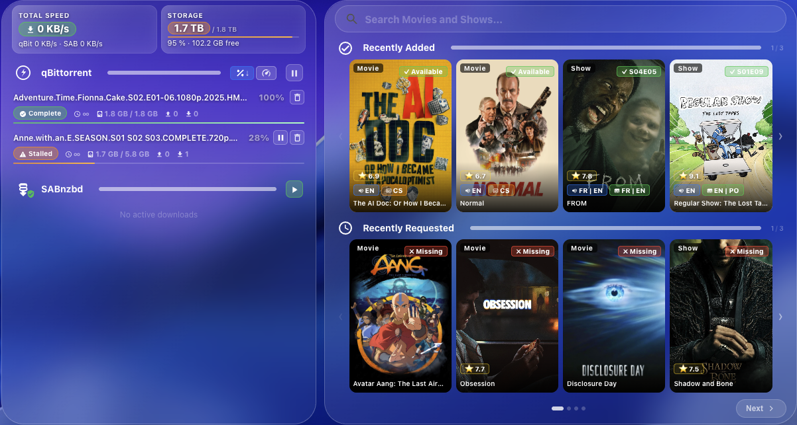
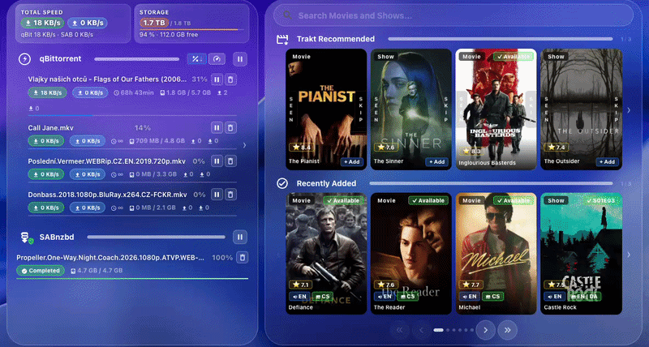

# Arr Stack Card

[](https://github.com/hacs/integration)
[](https://github.com/martinargalas/ha-arr-stack-card/releases)
[](https://www.home-assistant.io)
[](LICENSE)
[](https://discord.gg/WVCyejJfKd)

<a href="https://buymeacoffee.com/argii" target="_blank"></a>

<a href="https://discord.gg/WVCyejJfKd" target="_blank"></a>

Manage your full media server stack — Radarr, Sonarr, qBittorrent, Deluge, rTorrent, SABnzbd, NZBGet, Overseerr/Jellyseerr, Bazarr, Plex, Jellyfin, Emby, Kodi, Tautulli, Jellystat, Tracearr, Prowlarr, and Trakt — directly from Home Assistant with a single unified dashboard card.

### Supported services

<p>   &nbsp;    &nbsp;   &nbsp;    &nbsp;  &nbsp;     &nbsp;    &nbsp; </p>






---

> [!IMPORTANT]
> This project consists of **two components** — both are required:
> - **[Arr Stack Integration](https://github.com/martinargalas/arr-stack-integration)** — backend proxy (install first)
> - **Arr Stack Card** (this repo) — the Lovelace frontend card

---

## Quick Setup

1. Install **[Arr Stack Integration](https://github.com/martinargalas/arr-stack-integration)** via HACS → Integrations
2. Install **Arr Stack Card** via HACS → Frontend (see [Installation](#installation) below)
3. Add `custom:arr-stack-card` to your dashboard — done

```yaml
type: custom:arr-stack-card
```

The card automatically shows only the services you have configured. No YAML required to get started.

---

## Supported services

| Service | Role | Required |
|---------|------|----------|
| Radarr | Movie library, downloads, interactive search | ✅ Yes |
| Sonarr | TV library, episode calendar, downloads | ✅ Yes |
| Radarr 2 | Second Radarr instance — HD + 4K workflow | Optional |
| Sonarr 2 | Second Sonarr instance — HD + 4K workflow | Optional |
| qBittorrent | Torrent download management | Optional |
| Deluge | Torrent download management | Optional |
| rTorrent / ruTorrent | Torrent download management | Optional |
| SABnzbd | Usenet download management | Optional |
| NZBGet | Usenet download management | Optional |
| Overseerr / Jellyseerr | Media requests, discovery, approvals | Optional |
| Bazarr | Subtitle status per movie/show | Optional |
| Plex | Active stream monitoring and playback control | Optional |
| Jellyfin | Active stream monitoring and playback control | Optional |
| Emby | Active stream monitoring and playback control | Optional |
| Kodi | Active stream monitoring and playback control | Optional |
| Tautulli | Watch history, statistics, and usage graphs | Optional |
| Jellystat | Watch history, statistics, and usage graphs | Optional |
| Tracearr *(beta)* | Watch history, statistics, and usage graphs | Optional |
| Prowlarr | Indexer management and search statistics | Optional |
| Trakt | Personalised movie & show recommendations | Optional |
| Gluetun | VPN status indicator in the downloads panel | Optional |

Services not configured in the integration are hidden automatically — no manual configuration needed.

---

## Features

### Downloads (left panel)

The left panel appears when at least one download manager is configured. You can enable, disable, and reorder clients from the visual editor (Left Panel — Download Clients section).

- **qBittorrent** — active torrents with download and upload speed, progress, seeder/leecher counts. Pause, resume, stop seeding, delete (with or without files), global pause/resume, sort by progress or speed. Total speed chip shows combined download and upload across all active torrents.
- **Deluge** — same feature set as qBittorrent: active torrents, speed, progress, seeds/peers, pause/resume per torrent and globally, delete with or without files.
- **rTorrent / ruTorrent** — same feature set as qBittorrent: active torrents, speed, progress, seeds/peers, pause/resume per torrent and globally, delete with or without files. Connects via the ruTorrent XMLRPC endpoint.
- **SABnzbd** — NZB queue with progress and speed, completed downloads inline, failed history with retry/delete, global pause/resume.
- **NZBGet** — NZB queue with progress, post-processing status, failed history with retry/delete, global pause/resume.
- **Disk space** — free space with usage bar, sourced from Radarr and Sonarr root folders. Disks are deduplicated automatically. If your media is spread across multiple disks, use the chevron arrows to page through them.
- **Gluetun VPN** — when Gluetun is configured, a shield badge appears in the downloads panel showing your VPN status, public IP, country, and provider logo.

#### Gluetun setup

Gluetun requires its control server API to be reachable from Home Assistant. Three things are needed:

1. **Expose port 8000** in your Gluetun container (map it to any host port, e.g. `8002:8000`).
2. **Create an API key config** at `/gluetun/auth/config.toml` inside the container (bind-mounted from your host):
   ```toml
   [[roles]]
   name = "admin"
   auth = "apikey"
   apikey = "your-api-key"
   routes = ["GET /v1/vpn/status", "GET /v1/publicip/ip"]
   ```
3. **Enter the URL and API key** in the Arr Stack Integration settings — use the host address HA can reach, e.g. `http://192.168.1.10:8002`.

### Right panel — configurable sections

The right panel is modular. You choose which sections appear and in what order via the visual editor. Each section can be enabled or disabled independently.

#### Movies & TV Shows

- **Recently Added** — your latest downloads, movies and shows mixed, sorted by date.
- **Recently Requested** — titles you've requested that are still downloading or waiting.
- **Movies** — your full movie collection with download status, ratings, audio tracks, and subtitle availability. Click any title to open a detail popup with poster, overview, ratings, and a trailer link. From there you can run an **Interactive Search** to manually pick a release, or cast directly to a Plex device.
- **TV Shows** — your full series collection with per-season progress, ratings, and subtitle status. Includes an **upcoming episodes calendar** with air dates. Interactive Search and Plex cast available here too.

#### Library

A full-screen panel for browsing and managing your entire movie and TV show collection. Open it via the **Library** button in the right panel. Enabled by default for new installs.

- **Poster and table view** — switch between a resizable poster grid and a compact list with ratings, quality, file size, and status at a glance. In poster view, drag the grip handle to adjust column count on the fly — preference is saved per session.
- **Status badges** — each poster shows whether a title is available, downloading, missing, or waiting for a quality upgrade. Subtitle availability shown where configured.
- **Filter and sort** — filter by Movies, TV Shows, or both; sort by Recently Added, Title, Rating, or Quality; search by title.
- **Top Quality** — filter to see only movies that have a file but haven't reached your preferred quality yet.
- **Multiple instances** — if you run two separate movie or TV servers, switch between them or browse everything together in the **Both Instances** tab.
- **Bulk actions** — select individual titles or use Select All, then change quality profile, add or remove tags, or delete titles. Changes apply immediately to the right server.
- **Update All** — refresh metadata for your selection; **RSS Sync** — pull the latest releases from your indexers.
- Item count shown in the header so you always know how many titles match your current filter.

#### Calendar

Upcoming movies and TV episodes from Radarr and Sonarr. Click the calendar icon to open a weekly view with tabs for All, Shows, and Movies.

#### Discovery & Recommendations

- **Trending, popular, upcoming** — movies and TV shows, always available
- **Trakt recommendations** — personalised movie and show suggestions based on your Trakt watch history. Movies and shows are mixed together for variety. Each poster has two interactive buttons on its edges:
  - **Seen** (left edge) — marks the title as watched on Trakt. This improves future recommendations by feeding your actual watch history back into the algorithm. The card immediately replaces the dismissed poster with the next recommendation.
  - **Skip** (right edge) — hides the title from your recommendations without marking it as watched. Use this for titles you're simply not interested in, without affecting your Trakt history or stats.

  For recommendations to reflect what you've actually watched, you need a scrobbler that syncs your plays to Trakt automatically. If you use Plex, [PlexTraktSync](https://github.com/Taxel/PlexTraktSync) handles this — run it as a Docker container in `watch` mode and it will mark titles as watched on Trakt in real time.
- One-click or profile-based requests directly to Radarr/Sonarr, or via Overseerr/Jellyseerr
- **With Overseerr / Jellyseerr:** approve and decline pending requests, family account support with per-user request management

#### Now Playing

Live view of what's playing across your media servers — title, poster, progress bar, and source badge. Auto-hidden when nothing is playing. Supports Plex, Jellyfin, Emby, and Kodi simultaneously.

**Plex** — requires the official [Plex](https://www.home-assistant.io/integrations/plex/) HA integration. Configuring Plex in the Arr Stack Integration additionally enables:
- Active user shown on the stream card
- Remote stream termination (stop with a message) — works for all clients
- Full playback controls (play, pause, next, previous) — Plexamp only

> **Plex Server URL** — the integration auto-detects your server address during setup. If Home Assistant runs on a different machine or VLAN than Plex, you can override it with the address HA can reach (e.g. `http://192.168.1.10:32400`).

**Jellyfin** — requires the official [Jellyfin](https://www.home-assistant.io/integrations/jellyfin/) HA integration. Stream monitoring and stop playback work automatically once the integration is connected — no additional configuration needed in Arr Stack.

**Emby** — enter your Emby server URL and API key in the Arr Stack Integration setup (Plex / Emby step). Enables stream monitoring and remote stop with a message.

**Kodi** — requires the official [Kodi](https://www.home-assistant.io/integrations/kodi/) HA integration. Stream monitoring and stop with a notification work automatically once connected — no additional configuration needed in Arr Stack.

#### Cast to Plex device

A cast button appears in movie and show popups when the item exists in your Plex library. Clicking it opens a device picker — select a device to start playback immediately.

**Requirements:**

1. Plex configured in the Arr Stack Integration (token + server URL)
2. Official [Plex HA integration](https://www.home-assistant.io/integrations/plex/) installed and connected — devices are discovered via `media_player.plex_*` entities
3. Target device must be online and reachable by the Plex server

> Cast to the Plex mobile app works only when the app is open and on the player screen. Idle devices may not respond — this is a Plex limitation.

#### Activity Queue

Four-tab panel covering everything happening across your Radarr and Sonarr instances. Admin-only.

- **Queue** — what's downloading right now with progress, quality, and ETA. Manual Import or one-click remove with blocklist option.
- **History** — recent grabs and imports, filterable by event type, source, or quality.
- **Blocklist** — manage blocked releases.
- **Missing** — everything without a file. Filter, adjust monitoring, and trigger Interactive or Auto Search without leaving the panel.

The panel fits exactly as many items as your screen allows — no overflow, no scrollbar, clean layout from the first load.

#### Statistics (Tautulli / Jellystat / Tracearr)

Playback statistics from Tautulli, Jellystat, or Tracearr (configure any combination). Admin-only.

- Watch history with search and filters
- Play count and duration charts by day, day of week, hour, and media type
- Per-user and per-library statistics
- **Account sharing detection** — flags when the same account streams from multiple IPs simultaneously (Tautulli)
- **Tracearr** *(beta)* — watch patterns, completion rates, device and bandwidth analytics, binge highlights. Works with Plex, Jellyfin, and Emby.

#### Indexers (Prowlarr)

Indexer overview and search statistics from Prowlarr.

- Indexer health and status at a glance
- Per-indexer search success rate and response time
- User-agent breakdown — which apps hit your indexers and how often

### Appearance & UX

- Day / night theming based on `sun.sun`
- Responsive layout — mobile, tablet, desktop
- Sticky navigation bar on mobile
- Pagination for all sections; configurable columns per category
- **See More overlay** — full-screen grid for any section
- Visual card editor in HA (no YAML required for basic setup)
- Performance mode — disables backdrop blur
- Category colour overlays — colour-tinted poster overlays per section, toggle via `styles.categoryOverlays`
- Real app icons — uses the actual Radarr, Sonarr, qBittorrent, etc. logos. Switch to MDI icons via `styles.applicationIcons: mdi`
- UI scale — proportionally scales all card content via `styles.uiScale`. Useful on large monitors or TVs where the default size is too small
- Left panel width — adjustable via `styles.leftPanelWidth` (percentage of card width, default 40)
- Download client order — enable, disable, and reorder qBittorrent, Deluge, rTorrent, SABnzbd, and NZBGet from the visual editor. Only configured clients appear in the list

---

## Requirements

1. Home Assistant 2024.1+ with HACS installed
2. [Arr Stack Integration](https://github.com/martinargalas/arr-stack-integration) configured with at least Radarr and Sonarr
3. Everything else is optional — unconfigured services are hidden automatically

### Self-signed certificates / reverse proxies

If any of your services uses a self-signed or untrusted certificate, enable **Skip SSL certificate verification** in the integration's Global Settings. This covers all services at once.

---

## Installation

### Via HACS (recommended)

1. Open HACS → **Frontend**
2. Click the **⋮** menu (top right) → **Custom repositories**
3. Add `https://github.com/martinargalas/ha-arr-stack-card` — category **Dashboard**
4. Search for **Arr Stack Card** and install
5. Hard refresh your browser (Cmd+Shift+R / Ctrl+Shift+R)

### Manual

1. Download `arr-stack-card.js` from the latest release
2. Copy to `/config/www/arr-stack-card.js`
3. Add to Lovelace resources:
   ```yaml
   url: /local/arr-stack-card.js
   type: module
   ```

---

## Full Configuration

> **Visual editor** — most settings are available via the HA dashboard editor (click the pencil icon). Only `styles.*` and `security.*` keys require manual YAML editing.

```yaml
type: custom:arr-stack-card

# General
localisation: en             # en | cs  (default: en)
layout: both                 # both | left | right  (default: both)
swap_sides: false            # swap left and right panels  (default: false)
                             # Note: on mobile, right panel moves above left. Set sticky_nav_offset ~2000 for nav to appear immediately.
sticky_nav_offset: 100       # px — when sticky nav bar appears on mobile  (default: 100)

# Download managers (left panel)
downloads:
  torrentItems: 3            # qBittorrent / Deluge / rTorrent items per page  (default: 3)
  usenetItems: 3             # SABnzbd / NZBGet items per page  (default: 3)

# Download client order & visibility (left panel)
downloadClients:
  - id: qbit
    enabled: true
  - id: deluge
    enabled: true
  - id: rtorrent
    enabled: true
  - id: sab
    enabled: true
  - id: nzbget
    enabled: true

# Discovery (right panel)
discover:
  categoriesCount: 3         # media categories shown per right-panel page  (default: 3)
  itemsPerCategory: 4        # columns per category grid  (default: 4)
  showMoreOnPage: 3          # page on which the "See More" overlay card appears  (default: 3)
  oneClickRequest: false     # skip request overlay — uses defaults below  (default: false)
  oneClickDefaultMovieProfile: ""     # quality profile name for one-click movie requests
  oneClickDefaultMovieTag: ""         # Radarr tag for one-click movie requests  (optional)
  oneClickDefaultMovieRootFolder: ""  # Radarr root folder for one-click movie requests  (optional)
  oneClickDefaultShowProfile: ""      # quality profile name for one-click TV requests
  oneClickDefaultShowTag: ""          # Sonarr tag for one-click TV requests  (optional)
  oneClickDefaultShowRootFolder: ""   # Sonarr root folder for one-click TV requests  (optional)

# Category order & visibility
categories:
  - id: recentlyAdded
    enabled: true
  - id: recentlyRequested
    enabled: true
  - id: upcoming
    enabled: true
  - id: tvUpcoming
    enabled: true
  - id: trending
    enabled: true
  - id: popular
    enabled: true
  - id: trakt
    enabled: false
  - id: calendar
    enabled: true
  - id: streams
    enabled: false
  - id: tautulli
    enabled: false
  - id: jellystat
    enabled: false
  - id: activity
    enabled: false
  - id: library
    enabled: true
  - id: prowlarr
    enabled: false

# Security
security:
  ip_sharing_threshold: 2    # unique IPs per user before sharing warning appears  (default: 2)
  ip_history_depth: 200      # history records scanned for IP detection  (default: 200)

# Appearance
styles:
  performanceMode: false          # disable backdrop blur
  cardBackground: "#121216"       # card background colour (performance mode only)
  cardBackgroundOpacity: 90       # card background opacity 0–100 (performance mode only)
  dayNightMode: true              # auto switch popup colours based on sun.sun
  categoryOverlays: true          # colour-tinted overlays on category poster grids  (default: true)
  applicationIcons: real          # real | mdi — use real app logos or MDI icons  (default: real)
  uiScale: 1                      # scale all card content — use >1 on large screens/TVs  (default: 1)
  leftPanelWidth: 40              # downloads panel width as % of card width  (default: 40)
  searchBarIconColor: ""
  headingTextColor: "#ffffff"
  headingColor: "#ffffff"
  primaryTextColor: "#ffffff"
  secondaryTextColor: "#aaaaaa"
  pagingButtonTextColor: "#ffffff"
  pagingButtonBackgroundColor: "#1e1e2e"
  pagingDotColor: "#555555"
  pagingDotActiveColor: "#ffffff"
  downloadButtonTextColor: "#ffffff"
  tagPillTextColor: "#ffffff"
  modalHeadingTextColor: "#ffffff"
  modalPrimaryTextColor: "#ffffff"
  modalSecondaryTextColor: "#aaaaaa"
  modalBackgroundColor: "#121216"      # set dayNightMode: false when using a custom colour
  modalOverlayColor: "#000000"
  modalCloseButtonIconColor: "#ffffff"
  modalCloseButtonBackgroundColor: "#333344"
  modalButtonTextColor: "#ffffff"
  modalButtonBackgroundColor: "#1e1e2e"
  modalRemoveButtonBackgroundColor: "#ff6030"
```

### Category IDs

| id | Section |
|----|---------|
| `recentlyAdded` | Recently Added |
| `recentlyRequested` | Recently Requested |
| `upcoming` | Upcoming Movies |
| `tvUpcoming` | New Shows |
| `trending` | Trending |
| `popular` | Popular Movies |
| `trakt` | Trakt Recommendations |
| `calendar` | Calendar — upcoming movies & episodes (Radarr + Sonarr), with weekly modal view |
| `streams` | Now Playing (Plex / Jellyfin / Emby / Kodi) — auto-hidden when nothing plays |
| `tautulli` | Statistics (Tautulli) |
| `jellystat` | Statistics (Jellystat) |
| `tracearr` | Statistics (Tracearr) *(beta)* |
| `library` | Library browser (Radarr / Sonarr — bulk edit, sort, filter) |
| `activity` | Activity Queue (admin only) |
| `prowlarr` | Indexers (Prowlarr) |

---

## Multi-user setup (Overseerr / Jellyseerr — optional)

> Without Overseerr/Jellyseerr, all HA users can add media directly to Radarr/Sonarr.

| HA account | What they can do |
|------------|-----------------|
| Admin | Browse, request, **approve/decline** pending requests |
| Non-admin | Browse, request, view and withdraw own requests |

**Setup:**

1. In Overseerr/Jellyseerr — create a non-admin user (Settings → Users → Add User).
2. In Home Assistant — create a non-admin HA user for each family member (Settings → People → Add Person → uncheck Administrator).
3. In the Arr Stack integration settings — enter the non-admin Overseerr user's email and password.

---

## Analytics

Arr Stack Card sends one anonymous ping per 24 hours. The following data is collected:

| Field | What it contains |
|-------|-----------------|
| **Card version** | e.g. `1.6.28` |
| **Anonymous site ID** | Short hash of your Home Assistant hostname — cannot be reversed to identify you or your server |
| **Enabled integrations** | Which services are configured (e.g. Plex, Bazarr, qBittorrent) — no credentials, URLs, or settings |
| **Mobile flag** | Whether the card is shown on a screen narrower than 600 px |

No IP addresses, hostnames, usernames, media titles, or any personally identifiable information are sent or stored. Rate-limited to one ping per IP per 24 hours.

Live usage stats (public): [argalas.org/arr-stats](https://argalas.org/arr-stats)

---

## License

MIT
