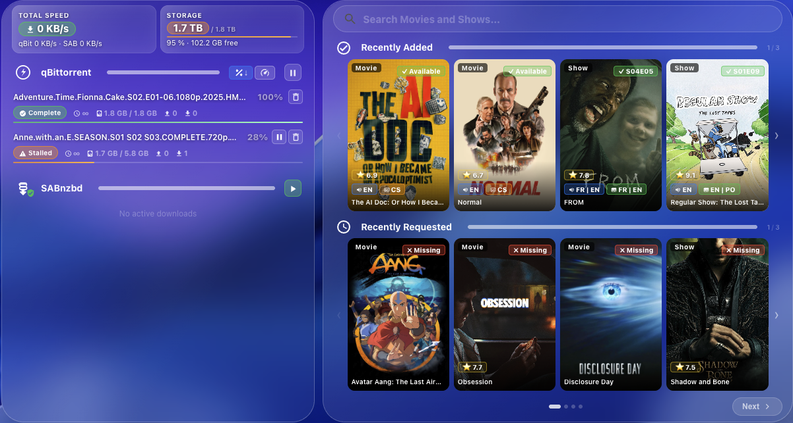
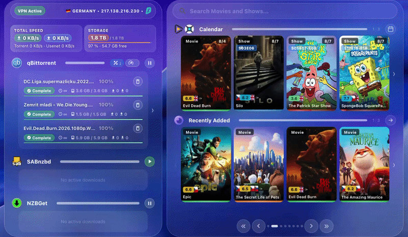
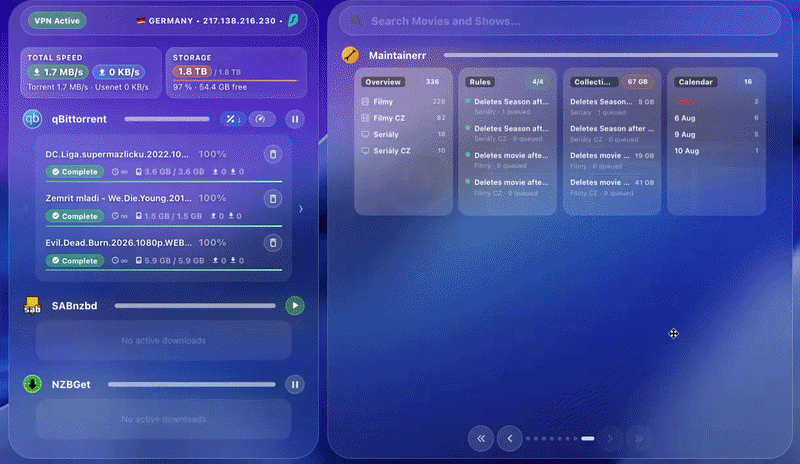
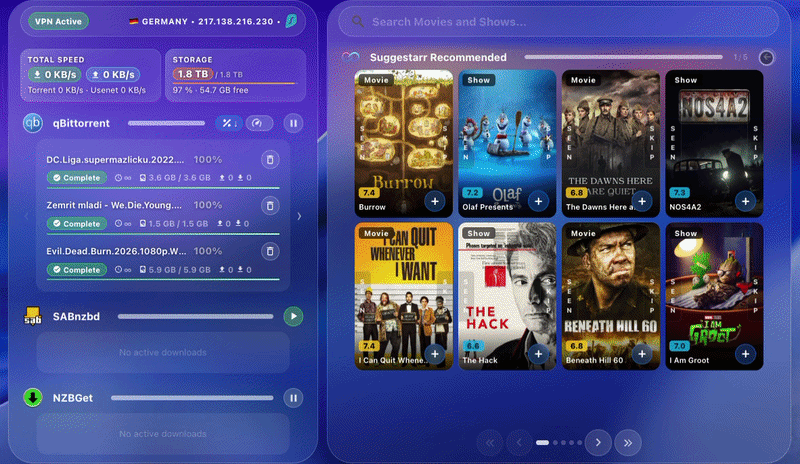

# Arr Stack Card

[](https://github.com/hacs/integration)
[](https://github.com/martinargalas/ha-arr-stack-card/releases)
[](https://www.home-assistant.io)
[](LICENSE)
[](https://discord.gg/WVCyejJfKd)

<a href="https://buymeacoffee.com/argii" target="_blank"></a>

<a href="https://discord.gg/WVCyejJfKd" target="_blank"></a>

Manage your full media server stack — Radarr, Sonarr, qBittorrent, Deluge, rTorrent, SABnzbd, NZBGet, Seerr (Overseerr/Jellyseerr), Bazarr, Plex, Jellyfin, Emby, Kodi, Tautulli, Jellystat, Tracearr, Prowlarr, Maintainerr, SuggestArr, and Trakt — directly from Home Assistant with a single unified dashboard card.

### At a glance

<p>   &nbsp;    &nbsp;   &nbsp;    &nbsp;   &nbsp;     &nbsp;    &nbsp;  </p>

---

> [!IMPORTANT]
> ### Your own TMDB API key — needed by 1 September 2026
>
> **If you use Seerr (Overseerr / Jellyseerr), this does not affect you.** Posters, search and title details all come through Seerr, and nothing changes for you.
>
> Everyone else needs a free TMDB API key by **1 September 2026**. Until then the card keeps working as it always has. The reason is simple: the card is going through the official HACS review, and the rules there do not allow a shared key to be built into the code, so it has to go.
>
> Getting one takes a minute at [themoviedb.org](https://www.themoviedb.org) → Settings → API — it is free and no payment details are asked for. Then paste it into **Settings → Devices & Services → Arr Stack → Reconfigure → Discovery**.
>
> Without a key after that date the posters, ratings, cast, trailers and the Trending and Popular rows stop loading. Everything tied to your own libraries — Radarr, Sonarr, downloads, the calendar — carries on regardless.
>
> Sorry for the errand. The card never asked you for anything before, and the notice disappears on its own once a key is filled in or Seerr is set up.

---










---

> [!IMPORTANT]
> This project consists of **two components** — both are required:
> - **[Arr Stack Integration](https://github.com/martinargalas/arr-stack-integration)** — backend proxy (install first)
> - **Arr Stack Card** (this repo) — the Lovelace frontend card

---

## Quick Setup

1. Install **[Arr Stack Integration](https://github.com/martinargalas/arr-stack-integration)** via HACS → Integrations
2. Install **Arr Stack Card** via HACS → Frontend (see [Installation](#installation) below)
3. Add `custom:arr-stack-card` to your dashboard — done

```yaml
type: custom:arr-stack-card
```

The card automatically shows only the services you have configured. No YAML required to get started.

---

## Supported services

| Service | Role | Required |
|---------|------|----------|
| Radarr | Movie library, downloads, interactive search | ✅ Yes |
| Sonarr | TV library, episode calendar, downloads | ✅ Yes |
| Radarr 2 | Second Radarr instance — HD + 4K workflow | Optional |
| Sonarr 2 | Second Sonarr instance — HD + 4K workflow | Optional |
| qBittorrent | Torrent download management | Optional |
| Deluge | Torrent download management | Optional |
| rTorrent / ruTorrent | Torrent download management | Optional |
| SABnzbd | Usenet download management | Optional |
| NZBGet | Usenet download management | Optional |
| Seerr (Overseerr / Jellyseerr) | Media requests, discovery, approvals | Optional |
| TMDB | Posters, ratings, cast, trailers, Trending and Popular rows | Optional with Seerr — **own key required from 1 Sep 2026 without it** |
| Bazarr | Subtitle status per movie/show | Optional |
| Plex | Active stream monitoring and playback control | Optional |
| Jellyfin | Active stream monitoring and playback control | Optional |
| Emby | Active stream monitoring and playback control | Optional |
| Kodi | Active stream monitoring and playback control | Optional |
| Tautulli | Watch history, statistics, and usage graphs | Optional |
| Jellystat | Watch history, statistics, and usage graphs | Optional |
| Tracearr *(beta)* | Watch history, statistics, and usage graphs | Optional |
| Prowlarr | Indexer management and search statistics | Optional |
| Trakt | Personalised recommendations — needs a paid VIP account | Optional |
| SuggestArr | Free recommendations from what you have watched | Optional |
| Maintainerr | Automatic library cleanup — adds "Gone in" countdowns everywhere | Optional |
| Gluetun | VPN status indicator in the downloads panel | Optional |

Services not configured in the integration are hidden automatically — no manual configuration needed.

---

## Features

### Downloads (left panel)

The left panel appears when at least one download manager is configured. You can enable, disable, and reorder clients from the visual editor (Left Panel — Download Clients section).

- **qBittorrent** — active torrents with download and upload speed, progress, seeder/leecher counts. Pause, resume, stop seeding, delete (with or without files), global pause/resume, sort by progress or speed. Total speed chip shows combined download and upload across all active torrents.
- **Deluge** — same feature set as qBittorrent: active torrents, speed, progress, seeds/peers, pause/resume per torrent and globally, delete with or without files.
- **rTorrent / ruTorrent** — same feature set as qBittorrent: active torrents, speed, progress, seeds/peers, pause/resume per torrent and globally, delete with or without files. Connects via the ruTorrent XMLRPC endpoint.
- **SABnzbd** — NZB queue with progress and speed, completed downloads inline, failed history with retry/delete, global pause/resume.
- **NZBGet** — NZB queue with progress, post-processing status, failed history with retry/delete, global pause/resume.
- **Disk space** — free space with usage bar, sourced from Radarr and Sonarr root folders. Disks are deduplicated automatically. If your media is spread across multiple disks, use the chevron arrows to page through them.
- **Gluetun VPN** — when Gluetun is configured, a shield badge appears in the downloads panel showing your VPN status, public IP, country, and provider logo.

#### Gluetun setup

Gluetun requires its control server API to be reachable from Home Assistant. Three things are needed:

1. **Expose port 8000** in your Gluetun container (map it to any host port, e.g. `8002:8000`).
2. **Create an API key config** at `/gluetun/auth/config.toml` inside the container (bind-mounted from your host):
   ```toml
   [[roles]]
   name = "admin"
   auth = "apikey"
   apikey = "your-api-key"
   routes = ["GET /v1/vpn/status", "GET /v1/publicip/ip"]
   ```
3. **Enter the URL and API key** in the Arr Stack Integration settings — use the host address HA can reach, e.g. `http://192.168.1.10:8002`.

### Right panel — configurable sections

The right panel is modular. You choose which sections appear and in what order via the visual editor. Each section can be enabled or disabled independently.

#### Movies & TV Shows

- **Recently Added** — your latest downloads, movies and shows mixed, sorted by date.
- **Recently Requested** — titles you've requested that are still downloading or waiting.
- **Movies** — your full movie collection with download status, ratings, audio tracks, and subtitle availability. Click any title to open a detail popup with poster, overview, ratings, and a trailer link. From there you can run an **Interactive Search** to manually pick a release, or cast directly to a Plex device.
- **TV Shows** — your full series collection with per-season progress, ratings, and subtitle status. Includes an **upcoming episodes calendar** with air dates. Interactive Search and Plex cast available here too.

#### Library

A full-screen panel for browsing and managing your entire movie and TV show collection. Open it via the **Library** button in the right panel. Enabled by default for new installs.

- **Poster and table view** — switch between a resizable poster grid and a compact list with ratings, quality, file size, and status at a glance. In poster view, drag the grip handle to adjust column count on the fly — your choice is remembered.
- **Status badges** — each poster shows whether a title is available, downloading, missing, or waiting for a quality upgrade. Subtitle availability shown where configured.
- **Filter and sort** — filter by Movies, TV Shows, or both; sort by Recently Added, Title, Rating, or Quality; search by title. In table view, click any column header to sort by that column — click again to reverse the order.
- **Top Quality** — filter to see only movies that have a file but haven't reached your preferred quality yet.
- **Multiple instances** — if you run two separate movie or TV servers, switch between them or browse everything together in the **Both Instances** tab.
- **Bulk actions** — select individual titles or use Select All, then change quality profile, add or remove tags, or delete titles. Changes apply immediately to the right server.
- **Update All** — refresh metadata for your selection; **RSS Sync** — pull the latest releases from your indexers.
- Item count shown in the header so you always know how many titles match your current filter.

#### Calendar

Upcoming movies and TV episodes from Radarr and Sonarr. Click the calendar icon to open a full view with tabs for All, Shows, and Movies.

Switch between a **week** and a **month** view — the month view is available on tablets and desktops, where there is room to show a whole month at once. Your choice is remembered. Click any day to see everything airing or releasing that day; click a title to open its detail popup.

#### Discovery & Recommendations

- **Trending, popular, upcoming** — movies and TV shows, always available
- **Trakt recommendations** — personalised movie and show suggestions based on your Trakt watch history. Trakt now requires a paid **VIP** account for this; the category stays for those who have one. Movies and shows are mixed together for variety. Each poster has two interactive buttons on its edges:
  - **Seen** (left edge) — marks the title as watched on Trakt. This improves future recommendations by feeding your actual watch history back into the algorithm. The card immediately replaces the dismissed poster with the next recommendation.
  - **Skip** (right edge) — hides the title from your recommendations without marking it as watched. Use this for titles you're simply not interested in, without affecting your Trakt history or stats.

  For recommendations to reflect what you've actually watched, you need a scrobbler that syncs your plays to Trakt automatically. If you use Plex, [PlexTraktSync](https://github.com/Taxel/PlexTraktSync) handles this — run it as a Docker container in `watch` mode and it will mark titles as watched on Trakt in real time.
- **SuggestArr recommendations** — a free, self-hosted alternative to Trakt, with its own category in the card. Trakt has moved personalised recommendations behind its paid VIP plan, so SuggestArr fills that gap for everyone else. It looks at what you have actually watched on Plex, Jellyfin or Emby and suggests titles you do not own yet. Movies and shows alternate in the row so you always get both. Request straight from the poster, or use **Seen** and **Skip** to steer what comes next.

  > **Set SuggestArr to ask, not to act.** In SuggestArr's own settings, turn off automatic requests to Seerr. Otherwise its background job sends requests on its own schedule and you only find out afterwards — with it off, suggestions wait in the card until you approve them.

  SuggestArr refreshes its pool on a schedule of its own, so a fresh batch of tips can take a while to appear after you work through the current one. See [SuggestArr](https://github.com/giuseppe99barchetta/SuggestArr) for setup.
- One-click or profile-based requests directly to Radarr/Sonarr, or via Seerr
- **With Seerr:** approve and decline pending requests, family and guest account support with per-user request management

#### Now Playing

Live view of what's playing across your media servers — title, poster, progress bar, and source badge. Auto-hidden when nothing is playing. Supports Plex, Jellyfin, Emby, and Kodi simultaneously.

**Plex** — requires the official [Plex](https://www.home-assistant.io/integrations/plex/) HA integration. Configuring Plex in the Arr Stack Integration additionally enables:
- Active user shown on the stream card
- Remote stream termination (stop with a message) — works for all clients
- Full playback controls (play, pause, next, previous) — Plexamp only

> **Plex Server URL** — the integration auto-detects your server address during setup. If Home Assistant runs on a different machine or VLAN than Plex, you can override it with the address HA can reach (e.g. `http://192.168.1.10:32400`).

**Jellyfin** — requires the official [Jellyfin](https://www.home-assistant.io/integrations/jellyfin/) HA integration. Stream monitoring and stop playback work automatically once the integration is connected — no additional configuration needed in Arr Stack.

**Emby** — enter your Emby server URL and API key in the Arr Stack Integration setup (Plex / Emby step). Enables stream monitoring and remote stop with a message.

**Kodi** — requires the official [Kodi](https://www.home-assistant.io/integrations/kodi/) HA integration. Stream monitoring and stop with a notification work automatically once connected — no additional configuration needed in Arr Stack.

#### Cast to Plex device

A cast button appears in movie and show popups when the item exists in your Plex library. Clicking it opens a device picker — select a device to start playback immediately.

**Requirements:**

1. Plex configured in the Arr Stack Integration (token + server URL)
2. Official [Plex HA integration](https://www.home-assistant.io/integrations/plex/) installed and connected — devices are discovered via `media_player.plex_*` entities
3. Target device must be online and reachable by the Plex server

> Cast to the Plex mobile app works only when the app is open and on the player screen. Idle devices may not respond — this is a Plex limitation.

#### Activity Queue

Four-tab panel covering everything happening across your Radarr and Sonarr instances. Admin-only.

- **Queue** — what's downloading right now with progress, quality, and ETA. Manual Import or one-click remove with blocklist option.
- **History** — recent grabs and imports, filterable by event type, source, or quality.
- **Blocklist** — manage blocked releases.
- **Missing** — everything without a file. Filter, adjust monitoring, and trigger Interactive or Auto Search without leaving the panel.

The panel fits exactly as many items as your screen allows — no overflow, no scrollbar, clean layout from the first load.

#### Statistics (Tautulli / Jellystat / Tracearr)

Playback statistics from Tautulli, Jellystat, or Tracearr (configure any combination). Admin-only.

- Watch history with search and filters
- Play count and duration charts by day, day of week, hour, and media type
- Per-user and per-library statistics
- **Account sharing detection** — flags when the same account streams from multiple IPs simultaneously (Tautulli)
- **Tracearr** *(beta)* — watch patterns, completion rates, device and bandwidth analytics, binge highlights. Works with Plex, Jellyfin, and Emby.

#### Maintainerr

[Maintainerr](https://github.com/jorenn92/Maintainerr) decides what leaves your library — rules like "delete a movie 30 days after everyone has watched it". The card gives it a category of its own, and, more importantly, brings its verdict everywhere else.

- **Gone in tags** — any title queued for deletion carries a countdown badge on its poster, in every category and in its detail popup. This is the main reason to connect Maintainerr: you see what is about to disappear while browsing, not only when you go looking for it. Clicking the badge opens the collection the title is queued in.
- **Rules** — browse, run, edit, and create rules without leaving Home Assistant, including the full condition builder and importing a rule from YAML.
- **Collections** — see what is queued, when each title goes, and how much space it will free. Add or remove titles by hand, and manage exclusions for anything that should never be touched.
- **Calendar** — the deletion schedule laid out by day, so nothing surprises you.
- **Storage** — disk usage and how much the cleanup has reclaimed so far.

Maintainerr needs no password, so only its address goes into the integration.

#### Indexers (Prowlarr)

Indexer overview and search statistics from Prowlarr.

- Indexer health and status at a glance
- Per-indexer search success rate and response time
- User-agent breakdown — which apps hit your indexers and how often

### Across the card

#### Title detail popup

Clicking any poster — anywhere in the card — opens the same detail popup: backdrop, overview, ratings, cast and trailer, plus everything the card knows about your own copy. Files on disk are described in their own row: the quality of the file you actually have (for example `1080p · BluRay`), which audio tracks it carries and which subtitles are available.

The buttons at the top of the popup are grouped into three menus, one open at a time:

- **Search** — Automatic or Interactive search, per instance if you run two. Automatic hands the job to Radarr or Sonarr; Interactive lists the releases and lets you pick one yourself, with episode-level control for shows.
- **Remove** — remove from the library, or from the library and disk. Always asks for confirmation first.
- **Actions** — everything else, described below.

#### Actions menu

Actions collects the things you would otherwise go looking for in other parts of the card, or in another application entirely. Every entry appears only when it can actually do something, so the menu is short and never offers a dead end.

| Action | Appears when | What it does |
|--------|--------------|--------------|
| Show in library | The title is in Radarr or Sonarr | Opens the Library panel filtered to it — and takes you back when you close it |
| Jump to download | It is downloading right now | Opens the Activity queue on that item |
| Stop playback | Someone is watching it | Stops the stream, with a message to the player |
| Play on | The file exists and Plex is configured | Casts to any Plex device that is on |
| Schedule for removal | Maintainerr is configured | Queues the title, or individual seasons, for deletion |
| Cancel scheduled removal | It is queued for deletion | Takes it back out |
| Exclude from removal | Maintainerr is configured | Marks it as never to be touched by the rules |
| Withdraw request | You have a pending request for it | Cancels the request in Seerr |
| Upcoming episodes | It is a running show | The next air dates, without opening the calendar |
| Watch statistics | A statistics service is configured | Who watched it, how long, and when |

**Where watch statistics come from.** If you run **Tracearr**, it answers, because it already watches Plex, Jellyfin and Emby together and reports one honest total per title rather than a separate number per server. Without it the card falls back to **Jellystat** for Jellyfin and **Tautulli** for Plex, whichever can find the title. The icon on the menu row tells you which one was asked.

#### Downloads identified by title

Rows in the qBittorrent, Deluge, rTorrent, SABnzbd and NZBGet lists are matched back to the movie or episode they belong to, so clicking one opens that title's detail popup with its poster and description — no need to read a release name to work out what is downloading.

Anything added by hand, outside Radarr and Sonarr, has nothing to open. Clicking those says so plainly instead of opening the wrong title.

### Poster display settings

Control what appears on poster cards across all categories. All options are available in the visual editor under **Posters**.

- **Title** — show or hide the title overlay at the bottom of each poster
- **Audio language** — show audio track badges (e.g. EN, CZ) on posters where available
- **Subtitles** — show subtitle availability badges (requires Bazarr)
- **Rating** — show a rating badge on each poster. Choose between **IMDb** (default) or **TMDB** as the source
- **Media type tag** — a small Movie or TV label in the top-left corner of each poster
- **Language display** — how audio and subtitle languages appear on a poster:
  - **Combined — flags** (default) — small country flags tucked around the rating badge, subtitles on the left and audio on the right. Compact enough to leave the artwork visible, and readable at a glance without reading anything
  - **Separate tags** — labelled badges with language codes (`EN`, `CZ`) instead of flags. Use this if you prefer words to symbols, or if the flags are too small on your screen

  Both follow the Audio and Subtitles switches above — turning one off drops that side. The same setting drives the language chips in the title detail popup.
- **"Gone in" countdown** — where the Maintainerr deletion countdown appears: in **all categories**, only inside the **Maintainerr** panel, or **never**. Requires Maintainerr.
- **Status display** — choose how download and availability status is shown:
  - **Tags** — coloured status badges on the poster (default)
  - **Stripes** — a thin coloured bar at the bottom of the poster. When a title is actively downloading, the bar shows a progress indicator
  - **Both** — tags and stripes together

### Appearance & UX

- One visual language across every category and panel — the same capsules, tables, filters and pagination everywhere, so a panel you have never opened still works the way you expect
- Day / night theming based on `sun.sun`
- Responsive layout — mobile, tablet, desktop
- Sticky navigation bar on mobile
- Pagination for all sections; configurable columns per category
- **See More overlay** — full-screen grid for any section
- Visual card editor in HA (no YAML required for basic setup)
- Performance mode — disables backdrop blur
- Category colour overlays — colour-tinted poster overlays per section, toggle via `styles.categoryOverlays`
- Real app icons — uses the actual Radarr, Sonarr, qBittorrent, etc. logos. Switch to MDI icons via `styles.applicationIcons: mdi`
- UI scale — proportionally scales all card content via `styles.uiScale`. Useful on large monitors or TVs where the default size is too small
- Left panel width — adjustable via `styles.leftPanelWidth` (percentage of card width, default 40)
- Download client order — enable, disable, and reorder qBittorrent, Deluge, rTorrent, SABnzbd, and NZBGet from the visual editor. Only configured clients appear in the list

---

## Requirements

1. Home Assistant 2024.1+ with HACS installed
2. [Arr Stack Integration](https://github.com/martinargalas/arr-stack-integration) configured with at least Radarr and Sonarr
3. Everything else is optional — unconfigured services are hidden automatically

### Self-signed certificates / reverse proxies

If any of your services uses a self-signed or untrusted certificate, enable **Skip SSL certificate verification** in the integration's Global Settings. This covers all services at once.

---

## Installation

### Via HACS (recommended)

1. Open HACS → **Frontend**
2. Click the **⋮** menu (top right) → **Custom repositories**
3. Add `https://github.com/martinargalas/ha-arr-stack-card` — category **Dashboard**
4. Search for **Arr Stack Card** and install
5. Hard refresh your browser (Cmd+Shift+R / Ctrl+Shift+R)

### Manual

1. Download `arr-stack-card.js` from the latest release
2. Copy to `/config/www/arr-stack-card.js`
3. Add to Lovelace resources:
   ```yaml
   url: /local/arr-stack-card.js
   type: module
   ```

---

## Configuration

The card works with no YAML at all — it shows whatever the integration has configured.
When you do want to change something, the visual editor covers nearly everything:
open the dashboard editor and click the pencil on the card.

Every key, its default and the list of category ids live in
**[CONFIGURATION.md](CONFIGURATION.md)**.

---

## Multi-user setup (Seerr — optional)

> Without Seerr, all HA users can add media directly to Radarr/Sonarr.

| HA account | What they can do |
|------------|-----------------|
| Admin | Browse, request, **approve/decline** pending requests |
| Non-admin | Browse, request, view and withdraw own requests |

**Setup:**

1. In Seerr — create a non-admin user (Settings → Users → Add User).
2. In Home Assistant — create a non-admin HA user for each family member (Settings → People → Add Person → uncheck Administrator).
3. In the Arr Stack integration settings — enter that user's email and password as the **Family account**.

### Guest account (optional)

If you have visitors or temporary users who should use a separate Seerr account, create a second non-admin user in Seerr and enter their credentials as the **Guest account** in the integration settings. Once both Family and Guest accounts are configured, a **Users** tab appears in the card editor where you can assign specific HA users to either account. Users not explicitly mapped default to the Family account.

### One-click requests

By default, requesting a movie or show opens a profile selection overlay. Enable **One-click Request** in the card editor to skip the overlay and use your configured defaults instead — one tap to request.

Available settings (card editor → One-click Request):

- **Season mode** — which seasons to request for shows: first season only, latest season, or all seasons
- **Non-admin only** — restrict one-click to non-admin users while admins keep the full profile picker

---

## Analytics

Arr Stack Card sends one anonymous ping per browser session. The following data is collected:

| Field | What it contains |
|-------|-----------------|
| **Card version** | e.g. `1.8.0` |
| **Anonymous site ID** | Short hash of your Home Assistant hostname — cannot be reversed to identify you or your server |
| **Enabled integrations** | Which services are configured (e.g. Plex, Bazarr, qBittorrent) — no credentials, URLs, or settings |
| **Mobile flag** | Whether the card is shown on a screen narrower than 600 px |
| **Activation flag** | Whether you interacted with the card during this session (clicked anything) |

No IP addresses, hostnames, usernames, media titles, or any personally identifiable information are sent or stored. Rate-limited to one ping per IP per minute on the server side. Data is retained for 6 months.

Live usage stats (public): [argalas.org/arr-stats](https://argalas.org/arr-stats)

### Opting out

If you would rather not take part, you can switch it off: **Settings → Devices & Services → Arr Stack → Reconfigure**, tick **Metrics collection** in the service list, then turn on the opt-out switch on the last step. This installation stops sending anything from that moment on.

---

## License

MIT
